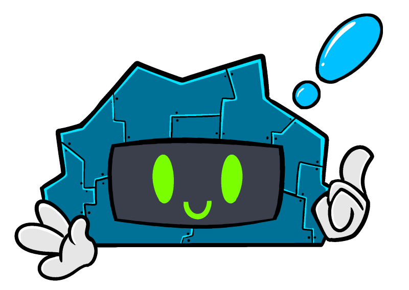

# Cloud Bot
 
<!-- ALL-CONTRIBUTORS-BADGE:START - Do not remove or modify this section -->
[](#contributors-)
<!-- ALL-CONTRIBUTORS-BADGE:END -->

Simple Twitch chatbot for Twitch Stream, build with [Comfy.JS](https://github.com/instafluff/ComfyJS). 



First it was a pretext to learn (or refresh) my JavaScript knowledge, but it became quickly fun to add more and more feature to it. Have a look customize it. make suggestion... this is pure fun. :)

Currently Available Commands
----------------------------

Games:
- **!stats**: Display current user stats

Sounds:
- **!bonjour**: play sound "Bonjour Hi"
- **!bad**: play sound "Bonjour Hi"
- **!yeah**: play sound "Yeeeeeeaaaah!"
- **!knock** : Play sound "Realistic knock on a door"

CB:
- **!cloud** : Show CD (aka Cloud Bot) GIF

Tools: 
- **!time** <text>: Add a time log to the show notes (those are used to create timestamps on YouTube)
- **!attention** <text>: Play a notification sound and draw the text in the screen.
- **!note** <text>: Add a note/ code snippet / url useful during the stream


Only Broadcaster:
- **!scores**: display table of highest scores
- **!clean**: hide/ clean all previous text in the screen
- **!load**: Load the file containing the previous session data.
- **!save**: Save in a local file `streamSession.json` the current session data.
- **!talk**: The bot will repete the message

- **!todo-add** <text>:  Add a new To-Do
- **!todo-start** <number>:  Set the identified To-Do as active
- **!todo-cancel** <number>:  Set the identified To-Do as cancelled
- **!todo-done** <number>:  Set the identified To-Do as done/ closed

- **!reminder-add** <reminder Key Name> | reminder description:  Create a new reminder.
- **!reminder-stop** <reminder Key Name>:  Set the reminder with the name equal to <reminder Key Name> to DONE.
- **!reminder-pause** <reminder Key Name>:  Pause the reminder with the name equal to <reminder Key Name>. Set its status to inactive.


Upcomming Available Commands
----------------------------

- lift
- etc.

How to use it
-------------

### Directly from the code

The Cloudbot now required a server. A tiny one but it's not a static HTML web page anymore. It's using Node.js. You can run it locally or host it somewhere (ex: Azure).
If you decide to run it locally execute: `npm start` from inside the folder `src`.

Make a new browser source overlay into your streaming tools (ex: OBS, StreamLabs OBS) and connect it to the root url where the server is running. (ex: `http://localhost:3000`.

Create a file `secret.js` with the following code in it: 

```js
const authToken = "oauth:xxxxxxxxxxxxxxxxxxxxxxxxxxxxx";
```

Replace the token by the value found on: https://twitchapps.com/tmi/

Finally replace fboucheros by the name of your Twitch Channel on the last line. 

```js
 ComfyJS.Init( "fboucheros", authToken );
```

### Using Docker Container

This project is now available in a container. You can find it on: [https://hub.docker.com/repository/docker/fboucher/cloudbot](https://hub.docker.com/repository/docker/fboucher/cloudbot)

- The container by default uses the port 3000, you can map it to a different one if you want to keep 3000 available for some other node development (in the command below, the chat bot will be available at http://localhost:3001). 

- The `${PWD}` is the current local folder on the host. This folder MUST CONTAINED: 
  - a file `secret.js`  with a auth key in it.

    ```javascript
    const authToken = "oauth:____________________";
    ```

  - a file `streamSession.json` To initialize the sessions.

    ```json
    {
      "Project": "",
      "Id": 42,
      "DateTimeStart": "",
      "DateTimeEnd": "",
      "Notes": [],
      "UserSession": [],
      "NewFollowers": [],
      "Raiders": [],
      "Subscribers": [],
      "Hosts": [],
      "Cheerers": [],
      "TimeLogs": [],
      "Todos": [],
      "Reminders": []
    }
    ```

Here an example how to instantiate the chatbot.

```bash
docker run -p 3001:3000 -d -v ${PWD}:/usr/src/app/io  --name ceebee fboucher/cloudbot:latest
```


~ **Have fun!**

---


## Contributors ✨

Thanks goes to these wonderful people ([emoji key](https://allcontributors.org/docs/en/emoji-key)):

<!-- ALL-CONTRIBUTORS-LIST:START - Do not remove or modify this section -->
<!-- prettier-ignore-start -->
<!-- markdownlint-disable -->
<table>
  <tr>
    <td align="center"><a href="http://cloud5mins.com"><br /><sub><b>Frank Boucher</b></sub></a><br /><a href="https://github.com/FBoucher/CloudBot/commits?author=FBoucher" title="Documentation">📖</a> <a href="https://github.com/FBoucher/CloudBot/commits?author=FBoucher" title="Code">💻</a> <a href="#ideas-FBoucher" title="Ideas, Planning, & Feedback">🤔</a></td>
    <td align="center"><a href="https://github.com/surlydev"><br /><sub><b>SurlyDev</b></sub></a><br /><a href="#ideas-surlydev" title="Ideas, Planning, & Feedback">🤔</a></td>
  </tr>
</table>

<!-- markdownlint-enable -->
<!-- prettier-ignore-end -->
<!-- ALL-CONTRIBUTORS-LIST:END -->

This project follows the [all-contributors](https://github.com/all-contributors/all-contributors) specification. Contributions of any kind welcome!


